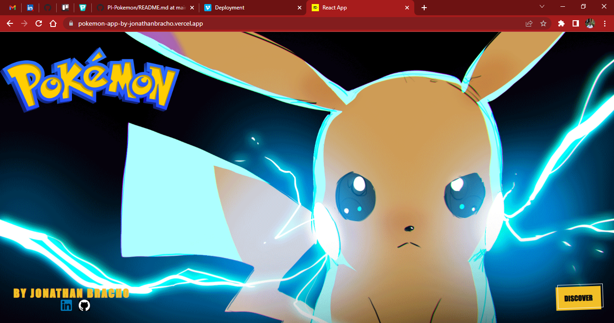
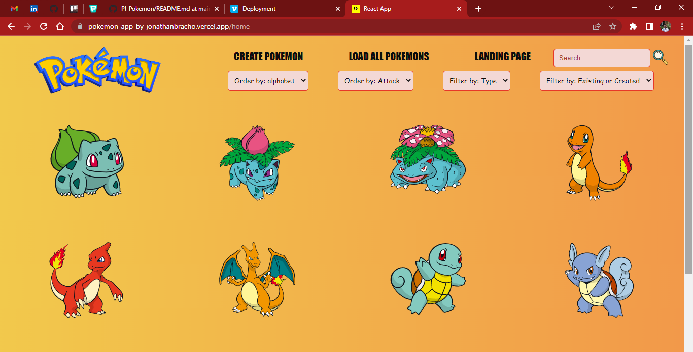

# Individual Project - Pokemon App

This project is a SPA that consumes information from the pokemon API: https://pokeapi.co/ and allows you to create, update and delete new pokemon as well as search by the exact name for any pokemon, filter by type or origin (database or API), sort alphabetically or by attack points.

- The development of the application was carried out using React, Redux for Frontend, Node.js with Express for the Backend and for the database, PostgreSQL and Sequelize were used.

- The styles have been developed with pure CSS and responsive design; it also has a pagination with previous, next and input buttons showing a maximum of twelve pokemons per page.

- Link to deployment: https://pokemon-app-by-jonathanbracho.vercel.app/
- Link to demo video: https://vimeo.com/747427349

